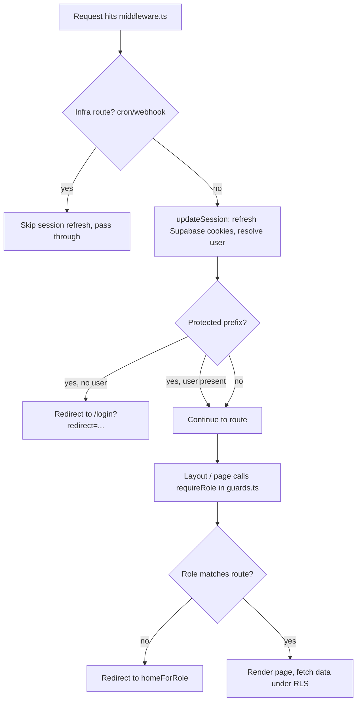
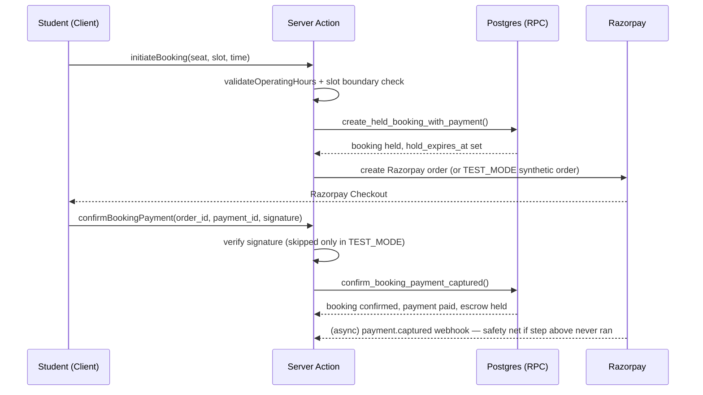

# 📚 Seatspace — Multi-Tenant Study Library Booking Platform

> Real-time seat booking, membership, and payout infrastructure for paid study libraries — built on Next.js 14 (App Router) and Supabase.

---

## Table of Contents

1. [Overview](#1-overview)
2. [Features](#2-features)
3. [Tech Stack](#3-tech-stack)
4. [Folder Structure](#4-folder-structure)
5. [Architecture Overview](#5-architecture-overview)
6. [User Roles](#6-user-roles)
7. [Database](#7-database)
8. [Authentication](#8-authentication)
9. [Installation](#9-installation)
10. [Environment Variables](#10-environment-variables)
11. [Running the Project](#11-running-the-project)
12. [Deployment](#12-deployment)
13. [Coding Standards](#13-coding-standards)
14. [Project Workflows](#14-project-workflows)
15. [Server Actions Reference](#15-server-actions-reference)
16. [API Routes](#16-api-routes)
17. [Realtime Features](#17-realtime-features)
18. [Error Handling](#18-error-handling)
19. [Performance](#19-performance)
20. [Security](#20-security)
21. [Known Limitations](#21-known-limitations)
22. [Future Improvements](#22-future-improvements)
23. [Contributing Guide](#23-contributing-guide)
24. [Troubleshooting](#24-troubleshooting)
25. [License](#25-license)

---

## 1. Overview

**Seatspace**  is a multi-tenant SaaS platform that lets independent paid study libraries (reading rooms / "seat libraries," a common model in Indian towns preparing students for competitive exams) list their space online, publish seat maps and time-slot pricing, and accept online bookings and payments. Students discover libraries near them, book a specific seat for a specific time slot, pay online, and check in with a QR code. Library owners run one or more branches from a dashboard; on-site staff handle walk-ins, check-ins, and the book-lending desk.

**Who uses it:**

| Actor | What they do in the product |
|---|---|
| **Student** | Discovers libraries, books/extends/cancels seats, subscribes to membership plans, borrows books, checks in via QR |
| **Owner** | Lists libraries, configures seats & time-slot pricing, manages staff, views revenue/payouts, handles walk-ins |
| **Staff** | Runs the front desk: check-in scanning, walk-in bookings, book issue/return, seat management |
| **Admin** | Platform operator: approves/suspends libraries, resolves refunds, runs payout oversight, watches system health |

**High-level architecture:** Seatspace is a single Next.js 14 App Router application. All data access, auth, and business rules live in **Server Actions** and a small set of **API routes** (webhooks + cron), backed by a single Supabase Postgres database with Row-Level Security (RLS) as the authorization boundary. Payments and payouts run through Razorpay (Orders API for student payments, Subscriptions API for the owner's platform fee, RazorpayX for payouts to owners). Live seat/notification updates are pushed via Supabase Realtime (Postgres change feeds).

**Main purpose:** replace manual/offline seat booking (phone calls, physical registers, walk-in-only availability) with a bookable, real-time, financially-reconciled system — while giving the platform operator (the "admin" role) a cut of every booking and a recurring subscription fee per listed library.

---

## 2. Features

> Only features with a corresponding implementation in the codebase are listed.

### Authentication
- Supabase Auth (email/phone based) via `@supabase/ssr`, cookie-based sessions
- Auth callback route (`/api/auth/callback`) for OAuth/magic-link exchange
- Role-based post-signup onboarding flow (`/onboarding/role`, `/onboarding/profile`, `/onboarding/owner-profile`, `/onboarding/staff-profile`, `/onboarding/add-library`, `/onboarding/library-photos`, `/onboarding/go-live`)
- A Postgres trigger (`handle_new_user`) provisions a `public.users` row on signup
- `prevent_role_self_elevation` trigger blocks a user from writing their own `role` column

### Library Management (Owner)
- Multi-library ownership — an owner can list and run several branches
- Library profile (name, description, address, geocoded lat/lng via a generated PostGIS `geography` point), photos, amenities
- Admin approval workflow — a library is only publicly visible once `approval_status = 'approved'`, `is_active = true`, **and** it has an active platform subscription (`has_active_platform_subscription()`)
- Suspension flow, tracked with reason/timestamp/admin actor

### Seat & Slot Configuration
- Per-library seat grid (`seats` table: row label + column number)
- Time-slot pricing (`slot_configs`): start/end time, applicable days of week (bitmask-style `smallint[]`), price, discount, active flag — checked via DB `CHECK` constraints (valid days, `start_time < end_time`, non-negative price/discount)
- "Slot-only" pricing architecture: every booking's rate is resolved from the single slot whose window contains the booking's start time — there is **no** fallback base price (see [`lib/booking/pricing.ts`](src/lib/booking/pricing.ts))

### Seat Booking (Student)
- Interactive seat map with live status (`free` / `held` / `booked` / `inactive`), derived server-side from current bookings, not just a stored column
- Seat hold → payment → confirmation flow with a `hold_expires_at` window (prevents double-booking during checkout)
- Atomic hold creation via `try_lock_seat()` / `create_held_booking_with_payment()` Postgres functions
- Booking extension flow (extend an existing session, priced against the same slot logic)
- Booking cancellation
- Operating-hours + slot-boundary validation applied identically across all three booking entry points (student self-serve, owner manual booking, staff walk-in)

### Student Dashboard
- `explore` (library discovery/search, `search_libraries_by_distance()` PostGIS radius search), `library/[id]` detail + booking pages, `bookings`, `my-books`, `payments`, `profile`, `subscriptions`

### Owner Dashboard
- Overview stats, `bookings`, `my-libraries`, `plan-builder` (membership plans), `scanner` (check-in), `seat-manager`, `slot-config`, `staff` management, `billing` (platform subscription)

### Staff Dashboard
- `staff` home, `bookings`, `books` (catalog/issue desk), `request` (staff-to-library join requests), `scanner`, `seat-manager`, `walk-in` booking
- Two staff tiers: `staff` and `senior_staff` (`is_staff_of()` / `is_senior_staff_of()` DB functions gate permissions — e.g. only senior staff can add/edit/delete the book catalog)

### Payments (Razorpay)
- Order-based checkout for bookings (platform's own Razorpay account, no Route/linked-account transfers)
- Webhook-verified payment capture (`/api/payment/razorpay-webhook`) with HMAC signature verification and an idempotency ledger
- `TEST_MODE` payment bypass for exercising the full post-payment path without a live Razorpay transaction (server-env gated only)

### Escrow & Payouts
- "Fee-on-top" commission model: the owner receives exactly the library's listed price; the platform commission is added on top at checkout (see [`lib/booking/escrow.ts`](src/lib/booking/escrow.ts))
- Funds held in `escrow_status = held` until a booking is checked in **and** has ended, then flipped to `eligible` by a DB trigger
- Daily payout sweep (`/api/cron/run-payouts`) pays owners via RazorpayX (bank account or UPI VPA), using a persisted idempotency key per payout
- Payout **clawbacks**: if a refund is issued after a payout already settled, the owed amount is tracked in `payout_clawbacks` and deducted from the owner's next payout (Razorpay does not support reversing a completed payout)
- Reversal handling for payouts RazorpayX later reverses (T+3 bank rejection)

### Platform Subscriptions (Owner → Platform)
- Every library pays a recurring platform fee (default ₹500/mo) via Razorpay Subscriptions (UPI AutoPay), tracked in `platform_subscriptions` / `platform_subscription_payments`
- Grace period, past-due, halted, and cancellation states
- Subscription-required gate for public library visibility

### Memberships / Plans (Student ↔ Library)
- Owner-defined plans (`plans`) with price, duration, session limit, and scope (`library`-only or `cross`-library)
- Student subscriptions to plans (`subscriptions`) with status lifecycle (`active`/`expired`/`cancelled`/`pending`)

### Notifications
- In-app notifications table with channel (`email` / `whatsapp` / `in_app`) and delivery status
- Realtime delivery to the notification bell via Supabase Realtime INSERT subscription, filtered per user
- `notify_user()` DB helper and event-specific triggers (e.g. `notify_book_request_update`)

### Reviews
- `libraries.rating` / `total_reviews` aggregate columns (schema present; review submission UI/action was not found in the provided source — see [Known Limitations](#21-known-limitations))

### Books (Lending)
- Catalog (`books`), physical copies with status (`available`/`issued`/`reserved`/`lost`), issue/return tracking with due dates, guest issuance (name/phone, no account required)
- Student-facing book **request** workflow (`book_requests`) with owner/staff approval

### QR Check-in
- Each confirmed booking gets a QR code encoding a URL whose **final path segment** is the booking UUID (`lib/booking/qr.ts`)
- Staff scanner page parses either a bare UUID or a full URL by taking the last `/`-delimited segment
- `set_checked_in_at` trigger stamps `checked_in_at` server-side

### Reports & Analytics (Owner + Admin)
- Owner: monthly revenue (`monthly_revenue()` DB function), per-library dashboard stats
- Admin: platform-wide `platform_overview` view, `daily_booking_trend`, `daily_revenue_trend`, `daily_user_growth`, `monthly_platform_trend`, `settlement_summary` — all gated by `is_admin()` inside the view definition itself (returns zero rows for non-admins even if queried directly)

### Admin
- Library approval/suspension (`admin/libraries`)
- Payments oversight (`admin/payments`), payouts (`admin/payouts`), refunds (`admin/refunds`), platform subscriptions (`admin/subscriptions`)
- Observability page (`admin/observability`) surfacing the webhook dead-letter queue and alert history

### Realtime
- Seat layout live updates (`useSeatLayoutRealtime`) — subscribes to `postgres_changes` on `bookings` filtered by `library_id`, debounced re-fetch of authoritative seat status
- In-app notification bell live updates (`useNotifications`) — subscribes to `postgres_changes` INSERT on `notifications` filtered by `user_id`
- Both `bookings` and `notifications` are set to `REPLICA IDENTITY FULL` in the schema (required for Realtime to deliver full old/new row payloads)

### Background Jobs (Cron)
- `expire-holds` — flips stale `held` bookings to `cancelled`
- `flush-alerts` — drains the Upstash-queued alert log and delivers to Slack
- `reconcile-payments` — finds stuck/pending payments for manual or automated follow-up (`find_stuck_pending_payments()`)
- `run-payouts` — daily escrow → RazorpayX payout sweep
- `subscription-reminders` — inserts upcoming renewal/expiry reminders

### Observability
- Structured JSON logging in production, colorized console logging in development (`lib/logger.ts`)
- Durable `alert_log` table written **before** attempting Slack delivery, so alerts are never lost even if the delivery channel is down
- `webhook_events` ledger: every inbound webhook is recorded with a processing status and retry count, giving a dead-letter queue admins can inspect

---

## 3. Tech Stack

| Layer | Technology |
|---|---|
| **Frontend framework** | Next.js 14 (App Router), React 18 |
| **Language** | TypeScript (strict null checks on; some legacy `.jsx`/`.js` files remain, notably the landing page and layout) |
| **Backend** | Next.js Server Actions (`'use server'`) + Route Handlers (API routes) — no separate backend service |
| **Database** | Supabase Postgres, with PostGIS extension (geospatial library search) |
| **ORM / DB access** | `@supabase/supabase-js` + `@supabase/ssr` (no traditional ORM; typed via a generated `Database` type in `lib/supabase/types.ts`) |
| **Authentication** | Supabase Auth (cookie-based SSR sessions) |
| **Authorization** | Postgres Row-Level Security (RLS) + application-level role guards (`lib/auth/guards.ts`) |
| **Storage** | Supabase Storage (library images — see `next.config.mjs` `remotePatterns` for the Supabase storage host) |
| **Realtime** | Supabase Realtime (Postgres logical replication change feed) |
| **Payments** | Razorpay Orders API (student bookings), Razorpay Subscriptions API (owner platform fee), RazorpayX Payouts API (owner payouts) |
| **Rate limiting** | Postgres-backed fixed-window limiter (`rate_limit_increment()`), with Upstash Redis env vars present for a documented future swap to a sliding-window limiter |
| **Alerting** | Upstash Redis (queue) → Slack incoming webhook |
| **Validation** | Zod (`zod`, `@hookform/resolvers`) |
| **Forms** | React Hook Form |
| **State/data fetching** | TanStack React Query (`@tanstack/react-query`); mostly Server Components + Server Actions for data flow |
| **UI primitives** | Radix UI (accordion, dialog, dropdown, select, tabs, toast, tooltip, etc.), `cmdk`, `vaul`, `embla-carousel-react`, `input-otp`, `react-resizable-panels` |
| **Styling** | Tailwind CSS + `tailwindcss-animate`, `class-variance-authority`, `clsx`, `tailwind-merge`; Geist font package; custom Google Fonts (Syne, Instrument Serif, DM Sans) loaded via `next/font/google` |
| **Animation** | Framer Motion |
| **Charts** | Recharts |
| **QR codes** | `qrcode` |
| **Email** | Nodemailer |
| **Dates** | `date-fns` |
| **Deployment** | Vercel-oriented (image `remotePatterns`, cron-route conventions, `NODE_ENV==='production'` gating in cron auth all match Vercel's model) |
| **Dev tools** | ESLint (`eslint-config-next`), TypeScript compiler (type-check only, `noEmit: true`), Supabase CLI (`supabase/` migrations directory + linked project config) |

> ⚠️ **TODO:** No `.eslintrc`/`eslint.config.*` file was found in the provided archive, even though `eslint` and `eslint-config-next` are dependencies — confirm the intended config is present in the real repo (may have been excluded from the zip).

---

## 4. Folder Structure

```
├── src/
│   ├── app/                          # Next.js App Router — routes, layouts, API handlers
│   │   ├── (auth)/                   # Public auth + onboarding routes (route group, no URL segment)
│   │   │   ├── login/
│   │   │   ├── contact/
│   │   │   ├── auth-error/
│   │   │   └── onboarding/           # role, profile, owner-profile, staff-profile, add-library, library-photos, go-live
│   │   ├── (owner)/dashboard/        # Owner-only routes — real URL prefix is /dashboard
│   │   │   ├── billing/  bookings/  my-libraries/  plan-builder/
│   │   │   ├── scanner/  seat-manager/  slot-config/  staff/
│   │   ├── (staff)/staff/            # Staff-only routes — real URL prefix is /staff
│   │   │   ├── bookings/  books/  request/  scanner/  seat-manager/  walk-in/
│   │   ├── (student)/                # Student-only routes — URL prefixes are top-level (/explore, /bookings, etc.)
│   │   │   ├── explore/  library/[id]/book/{seat,confirm}/  bookings/  my-books/
│   │   │   ├── payments/  profile/  subscriptions/  books/
│   │   ├── (pages)/                  # Public static content — about, privacy, refunds, terms
│   │   ├── admin/                    # Platform admin — libraries, payments, payouts, refunds, subscriptions, observability
│   │   ├── api/
│   │   │   ├── auth/callback/        # Supabase Auth OAuth/magic-link exchange
│   │   │   ├── cron/                 # expire-holds, flush-alerts, reconcile-payments, run-payouts, subscription-reminders
│   │   │   └── payment/              # razorpay-webhook, subscription-webhook, payout-webhook
│   │   ├── layout.js  page.js        # Root layout (fonts, SEO/JSON-LD metadata) + marketing landing page
│   │   ├── robots.ts  sitemap.ts     # SEO
│   │   └── globals.css
│   ├── components/                   # React components, grouped by the role/area that owns them
│   │   ├── admin/  owner/  staff/  student/   # Role-specific dashboards, each with its own ui/ + skeletons/ subfolder
│   │   ├── layout/                   # Navbar, Footer
│   │   ├── sections/                 # Landing-page sections (Hero, Landing)
│   │   └── shared/                   # Cross-role primitives — ErrorBanner, Spinner, Toast, ScannerView, PageEffects
│   ├── contexts/                     # React Context providers (OwnerContext)
│   ├── hooks/                        # Client-side hooks: realtime subscriptions, geolocation, mobile detection, toast, Razorpay checkout
│   ├── lib/
│   │   ├── actions/                  # Server Actions ('use server'), organized by role/domain
│   │   │   ├── students/             # student-bookings, student-books, student-discovery, student-profile, student-subscriptions
│   │   │   ├── auth.ts  library.ts  owner.ts  owner-staff.ts
│   │   │   ├── staff.ts  staff-seat-actions.ts  staff-book-action.tsx
│   │   │   ├── payout-setup.ts  platform-subscription.ts
│   │   │   └── admin-*.ts            # dashboard, libraries, observability, payouts, refunds, subscriptions
│   │   ├── auth/guards.ts            # requireRole / requireActionRole — server-side role gating
│   │   ├── booking/                  # Pricing, validation, escrow math, QR, slot config, revenue — the booking domain model
│   │   ├── razorpay/server.ts        # Razorpay/RazorpayX SDK wrappers, signature verification
│   │   ├── supabase/                 # client.ts (browser), server.ts (SSR/Server Actions), service.ts (service-role), middleware.ts, types.ts (generated DB types)
│   │   ├── webhooks/idempotency.ts   # Shared webhook_events ledger helpers
│   │   ├── alerts.ts  logger.ts  rate-limit.ts  testMode.ts  config.ts  ist.ts  types.ts  utils.ts
│   │   ├── constants/theme.ts
│   │   └── utils/                    # format.ts, student.ts
│   └── middleware.ts                 # Route protection (session refresh + protected-prefix redirect)
├── supabase/                         # Supabase CLI project (linked-project config; migrations not included in this archive — see TODO)
├── next.config.mjs                   # Image remote patterns (Supabase Storage host)
├── tailwind.config.js  postcss.config.js
├── tsconfig.json  jsconfig.json
└── package.json
```

**Why this shape:**
- **Route groups by role** (`(owner)`, `(staff)`, `(student)`, `(auth)`, `(pages)`) keep each role's pages colocated without adding a URL segment — the middleware comment is explicit that the *real* URL prefixes (`/dashboard`, `/staff`, `/explore`, etc.) are what's actually matched, not the parenthesized folder names.
- **`lib/actions/` mirrors the role structure** in `app/`, so the page that renders a role's UI and the Server Actions that back it are easy to pair up mentally, while keeping all Supabase/Razorpay access out of Client Components.
- **`lib/booking/` is a standalone domain module** (pricing, validation, escrow, QR, revenue) deliberately shared verbatim across the student self-serve flow, the owner manual-booking flow, and the staff walk-in flow, so pricing/validation logic can't drift between entry points.
- **`lib/supabase/` separates client types by trust level** — anon browser client, anon SSR client, and a service-role client that is explicitly documented as forbidden outside trusted server contexts (webhooks, cron, admin actions with an explicit role check already performed).

---

## 5. Architecture Overview

### Rendering & data flow
Seatspace is Server-Component-first. Pages under `app/` are Server Components by default; they call Server Actions or read Supabase directly (via `createServerSupabaseClient()`) to fetch data at request time, then hand interactive pieces off to `*Client.tsx` Client Components (e.g. `DashboardClient`, `BookSeatClient`, `SeatGrid`). Mutations go through `'use server'` Server Actions in `lib/actions/`, which:

1. Resolve the current user via `getSupabaseUser()` (a React `cache()`-deduped Supabase call).
2. Gate access with `requireActionRole(role)` from `lib/auth/guards.ts`.
3. Perform the mutation — either directly via PostgREST calls that rely on RLS, or via a Postgres function (`create_held_booking_with_payment`, `confirm_booking_payment_captured`, etc.) when the operation must be atomic across multiple tables.
4. Call `revalidatePath()` so the next Server Component render picks up fresh data.

### Authentication & authorization flow



Two layers of authorization are deliberately kept separate:
- **`middleware.ts`** only answers "is anyone logged in" for a fixed list of protected URL prefixes — it does *not* know roles, to avoid an extra DB round-trip on every request.
- **`requireRole` / `requireActionRole`** (in layouts and Server Actions respectively) fetch the user's `role` from `public.users` once per request (deduped via `cache()`) and enforce the actual role match, redirecting to `homeForRole()` on mismatch.
- **RLS policies** are the final, non-bypassable authorization layer at the database level — even a bug in application-level role checks cannot leak another tenant's rows, because every table's policies re-derive the caller's permissions from `auth.uid()` via functions like `is_admin()`, `is_staff_of()`, `is_senior_staff_of()`, or direct `owner_id = auth.uid()` comparisons.

### Booking flow (server-authoritative)



### Realtime data flow
Supabase Realtime streams `postgres_changes` events over a WebSocket to subscribed browser clients. Seatspace deliberately treats these events as **invalidation signals, not patchable state** — on receiving an event, the client hook re-calls the same server action used for the initial render, rather than attempting to merge the raw changed row into UI state. This keeps seat-status derivation logic (which depends on the current time, not just a stored status column) in exactly one place.

### Escrow / money flow

```mermaid
flowchart LR
    A[Payment captured] -->|escrow_status = held| B[Booking checked in + ended]
    B -->|DB trigger: mark_escrow_eligible_on_checkin| C[escrow_status = eligible]
    C -->|daily cron: run-payouts| D[RazorpayX payout created]
    D -->|payout webhook| E[escrow_status = paid_out]
    E -.refund issued after payout.-> F[payout_clawbacks row created]
    F -->|deducted from| G[Owner's next payout]
```



---

## 6. User Roles

The `user_role` Postgres enum defines exactly four roles: `student`, `owner`, `staff`, `admin`. A user's home route is resolved by `homeForRole()`:

| Role | Home route | Responsibilities | Notable access rules |
|---|---|---|---|
| **student** | `/explore` | Discover libraries, book/extend/cancel seats, subscribe to plans, borrow books, check in via QR, manage own profile | RLS: can only read/write their own bookings, payments, notifications, subscriptions; can read public library data |
| **owner** | `/dashboard` | List and manage one or more libraries, configure seats/slots/plans, manage staff, view revenue, handle payouts setup, pay the platform subscription | RLS: full CRUD scoped to `libraries.owner_id = auth.uid()` and everything joined off owned libraries (seats, slot configs, images, bookings, staff) |
| **staff** | `/staff` | Front-desk operations for the library they're attached to: check-in scanning, walk-in bookings, book issue/return, seat management | Two tiers — `staff` (day-to-day desk ops) and `senior_staff` (also manages the book catalog: add/edit/delete books). Scoped via `is_staff_of(library_id)` / `is_senior_staff_of(library_id)`, driven by the `staff` table's `library_id` foreign key |
| **admin** | `/admin` | Platform operator: approve/suspend libraries, manage refunds, oversee payments/payouts/subscriptions platform-wide, monitor webhook/alert health | RLS: `is_admin()`-gated policies grant read/write across *every* tenant's data — the most privileged role in the system, and the only one whose SELECT views (`platform_overview`, trend views) intentionally return **zero rows** to anyone else even without app-level filtering |

`prevent_role_self_elevation` (a DB trigger) stops any user — including an owner or staff member — from updating their own `role` column directly; role changes must go through the intended flows (onboarding, admin action).

---

## 7. Database

The schema is a single Supabase Postgres database (`new_full_schema.sql`, 4,000+ lines) using UUID primary keys throughout, PostGIS for geospatial search, and Postgres enums for nearly every status field (avoiding free-text status drift).

### Core entities and relationships

- **`users`** — one row per authenticated person, `role` enum, onboarding flag, and (for owners) payout destination details (bank account or UPI VPA, plus the resulting Razorpay contact/fund-account IDs).
- **`libraries`** — owned by a `users` row (`owner_id`). Holds address/geolocation (a generated PostGIS `geo_point` column computed from `latitude`/`longitude`), approval workflow fields, and suspension fields.
- **`seats`** — belongs to a library; a simple row/column grid, each seat independently activatable.
- **`slot_configs`** — belongs to a library; defines priced time windows per day-of-week, the pricing source of truth.
- **`bookings`** — the central transactional table. Links a student, a library, and a seat to a time range (`start_time`/`end_time`, plus a *generated* `tsrange` column `booking_range` used for overlap-safe availability queries). Tracks status through the full lifecycle (`held → confirmed → checked_in → completed`, or `cancelled` / `expired` / `no_show`), and supports both `online` and `offline` (staff/owner-entered walk-in) booking modes.
- **`payments`** — one row per booking payment (or a subscription payment via `subscription_id`), carrying the Razorpay order/payment IDs, the escrow split (`platform_commission_amount`, `owner_payout_amount`, `base_amount`), and `escrow_status`.
- **`payouts`** — one row per booking payment paid out to an owner via RazorpayX, including the persisted idempotency key, gross/commission/net amounts in paise, and reversal tracking.
- **`payout_clawbacks`** — money owed back to the platform when a refund is issued on a booking whose payout already settled.
- **`refunds`** — admin-initiated full/partial refunds against a payment; a payment may have multiple partial refunds that must never sum past the original amount (enforced in application logic, not a DB constraint).
- **`platform_subscriptions`** / **`platform_subscription_payments`** — the *library's own* recurring platform fee (distinct from `subscriptions`, which is a *student's* membership plan with a library — the schema comments explicitly flag this naming collision).
- **`plans`** / **`plan_libraries`** / **`subscriptions`** — owner-defined membership plans (single-library or cross-library scope) and student enrollments in them.
- **`books`** / **`book_copies`** / **`book_issues`** / **`book_requests`** — the lending module: catalog, individual physical copies with status, issue/return records (including guest issuance), and a student-facing request/approval workflow.
- **`staff`** / **`staff_requests`** — links a user to a library with a role tier, via an approval request flow.
- **`notifications`** — in-app/email/WhatsApp notification records with read state.
- **`admin_actions`**, **`financial_audit_log`**, **`webhook_events`**, **`alert_log`**, **`rate_limit_counters`** — the operational backbone: an append-only audit trail for every money-bearing state transition, a webhook processing ledger (idempotency + dead-letter tracking), a durable alert record, and a Postgres-backed rate limiter.

### Reporting views (admin-only, self-gating)
`platform_overview`, `daily_booking_trend`, `daily_revenue_trend`, `daily_user_growth`, `monthly_platform_trend`, `settlement_summary`, and `pending_no_show_escrow` are all `CREATE VIEW`s with `WHERE public.is_admin()` baked into the view definition itself — a non-admin querying them directly gets zero rows, not an error, without needing a separate RLS policy on the view.

### Notable business-logic functions (run in Postgres, not just app code)
- `create_held_booking_with_payment` / `confirm_booking_payment_captured` / `confirm_booking_extension_captured` — atomic, multi-table booking + payment state transitions.
- `try_lock_seat` — the low-level primitive preventing two students from holding the same seat/time simultaneously.
- `expire_holds_before_insert` / `expire_stale_holds` / `sweep_expire_stale_holds` — stale-hold cleanup, both inline (on every new hold attempt) and via cron.
- `mark_escrow_eligible_on_checkin` — trigger that flips a payment to payout-eligible once a booking is checked in and has ended.
- `search_libraries_by_distance` — PostGIS KNN + radius search for the discovery page.
- `is_admin` / `is_staff_of` / `is_senior_staff_of` — the RLS building blocks referenced by nearly every policy.
- `log_financial_event` — the single write path into `financial_audit_log`.
- `rate_limit_increment` — atomic counter powering `lib/rate-limit.ts`.

### Row-Level Security
82 `CREATE POLICY` statements were found across the schema — every business table has RLS enabled and scoped by role/ownership, generally following the pattern `owner_id = auth.uid()` for owners, `is_staff_of(library_id)` / `is_senior_staff_of(library_id)` for staff, and `is_admin()` for platform admins, with a handful of `USING (true)` policies for genuinely public read data (e.g. library images, book catalog listings).

> ⚠️ **TODO:** The `supabase/` directory in the provided archive contains only CLI metadata (`.temp/linked-project.json`, version pins) — the actual timestamped migration files referenced throughout the code comments (e.g. `20260627090000_webhook_idempotency_and_audit.sql`, `20260626130500_platform_analytics_views.sql`) were not included in this archive. Documentation above is derived from `new_full_schema.sql` (a full dump) plus in-code comments referencing those migrations by name.

---

## 8. Authentication

- **Provider:** Supabase Auth, configured for email/phone sign-in (exact sign-in method e.g. OTP vs password was not directly inspectable from the client SDK config alone — see TODO).
- **Session mechanism:** Cookie-based SSR sessions via `@supabase/ssr`. Three client constructors exist for three trust contexts:
  - `createBrowserSupabaseClient()` — anon key, browser-only.
  - `createServerSupabaseClient()` — anon key, reads/writes the request's cookies; used in Server Components and Server Actions; wrapped in `getSupabaseUser()` (React `cache()`-deduped per request).
  - `createServiceSupabaseClient()` — **service-role key**, bypasses RLS entirely. Restricted by explicit code comment to: webhook handlers (no logged-in user exists), cron-triggered routes, and admin Server Actions that have *already* passed a `requireActionRole('admin')` check. Never imported into a Client Component.
- **Session refresh:** `middleware.ts` calls `updateSession()` on every non-infra request, which calls `supabase.auth.getUser()` to refresh the session and re-set cookies before any auth checks run.
- **Protected routes:** A fixed prefix list in `middleware.ts` (`/admin`, `/dashboard`, `/staff`, `/onboarding`, `/explore`, `/home`, `/library`, `/bookings`, `/my-books`, `/payments`, `/profile`, `/subscriptions`) redirects unauthenticated users to `/login?redirect=<original path>`. The code comment is explicit that these are the **real URL prefixes**, not the route-group folder names.
- **Role handling:** Middleware only checks "is there a session" — it does not know the user's role (avoiding a DB call on every request). Role enforcement happens one layer in, via `requireRole()` in layouts (redirects to the correct home on mismatch) and `requireActionRole()` inside Server Actions (returns a typed error instead of navigating, since actions can't redirect the caller mid-mutation the same way).
- **New user provisioning:** A Postgres trigger (`handle_new_user`) creates the corresponding `public.users` row automatically when a new `auth.users` row is created by Supabase Auth.
- **Auth callback:** `/api/auth/callback` handles the OAuth/magic-link code exchange back into a session.

> ⚠️ **TODO:** The exact sign-in UI flow (OTP vs. magic link vs. password, and whether phone or email is primary) is defined in `src/app/(auth)/login/page.tsx` and `lib/actions/auth.ts` — worth a dedicated auth-flow diagram once those files are reviewed in detail; this README summarizes the session/authorization plumbing that surrounds it rather than the exact login UX.

---

## 9. Installation

### Prerequisites
- Node.js (a version compatible with Next.js 14 / React 18 — Node 18.18+ or 20+ recommended)
- npm (a `package-lock.json`/`npm` workflow is assumed; no other lockfile was found)
- A Supabase project (Postgres + Auth + Storage + Realtime enabled)
- A Razorpay account (Orders, Subscriptions, and RazorpayX enabled) — or `TEST_MODE=true` for local development without live payments
- (Optional, for production-grade rate limiting/alerting) An Upstash Redis database

### Clone

```bash
git clone <repository-url>
cd code
```

### Install dependencies

```bash
npm install
```

### Configure environment variables

Copy the variables listed in [Environment Variables](#10-environment-variables) into a `.env.local` file at the project root. No `.env.example` file was found in the provided archive — create one to match the table below.

### Set up Supabase

```bash
# Log in and link to your Supabase project
npx supabase login
npx supabase link --project-ref <your-project-ref>

# Apply the schema — the provided new_full_schema.sql is a full dump; run it
# against a fresh database, or reconstruct it as timestamped migrations under
# supabase/migrations/ if you want migration history (not included in this archive)
psql "<your-supabase-connection-string>" -f new_full_schema.sql
```

Then, in the Supabase dashboard:
- Enable the `postgis` and `uuid-ossp` (or equivalent) extensions if not already active (referenced by the schema as `extensions.uuid_generate_v4()` and `public.geography`/`public.st_makepoint`).
- Create a public Storage bucket for library images matching the host configured in `next.config.mjs` (`okcwpxzpxnbckqmbwnwi.supabase.co` — replace with your own project's storage host).
- Configure Row-Level Security is already defined in the schema dump; verify RLS is **enabled** on every table after import (`ALTER TABLE ... ENABLE ROW LEVEL SECURITY` statements are part of the dump but worth double-checking post-import).

### Configure Razorpay

- Create webhook endpoints in the Razorpay dashboard pointing at `/api/payment/razorpay-webhook`, `/api/payment/subscription-webhook`, and `/api/payment/payout-webhook`, subscribed to the relevant events (`payment.captured`, `payment.failed`, `refund.processed`, `refund.failed` for the booking webhook; subscription.* events for the subscription webhook; payout.* events for the payout webhook).
- Set matching secrets in your environment (see table below).

### Run locally

```bash
npm run dev
```

The app runs at `http://localhost:3000`.

---

## 10. Environment Variables

Only variables actually referenced via `process.env` in the codebase are listed. No `.env.example` was present in the provided source — this table should be used to construct one.

| Variable | Description | Required | Example |
|---|---|---|---|
| `NEXT_PUBLIC_SUPABASE_URL` | Supabase project URL | ✅ | `https://xxxx.supabase.co` |
| `NEXT_PUBLIC_SUPABASE_ANON_KEY` | Supabase anon/public API key (browser + SSR client) | ✅ | `eyJhbGciOi...` |
| `SUPABASE_SERVICE_ROLE_KEY` | Supabase service-role key — server-only, bypasses RLS. Used by webhooks, cron routes, and admin actions | ✅ (server) | `eyJhbGciOi...` |
| `NEXT_PUBLIC_SITE_URL` | Canonical site URL, used for SEO metadata/JSON-LD and OG tags | ✅ | `https://Seatspace.in` |
| `NEXT_PUBLIC_GOOGLE_MAPS_KEY` | Google Maps API key (location picker / map view) | ✅ (if maps used) | `AIzaSy...` |
| `NEXT_PUBLIC_GOOGLE_SITE_VERIFICATION` | Google Search Console verification token | Optional | `abc123...` |
| `RAZORPAY_KEY_ID` | Razorpay API key ID (Orders API — student booking payments) | ✅ | `rzp_live_...` |
| `RAZORPAY_KEY_SECRET` | Razorpay API key secret | ✅ | `••••••••` |
| `RAZORPAY_WEBHOOK_SECRET` | Shared secret to verify the booking-payment webhook signature | ✅ | `••••••••` |
| `RAZORPAY_PLATFORM_PLAN_ID` | Razorpay Plan ID for the owner platform subscription | ✅ | `plan_xxxxx` |
| `RAZORPAY_SUBSCRIPTION_WEBHOOK_SECRET` | Shared secret for the platform-subscription webhook | ✅ | `••••••••` |
| `RAZORPAYX_KEY_ID` | RazorpayX API key ID (owner payouts) | ✅ | `rzp_live_...` |
| `RAZORPAYX_KEY_SECRET` | RazorpayX API key secret | ✅ | `••••••••` |
| `RAZORPAYX_ACCOUNT_NUMBER` | RazorpayX source account number payouts are debited from | ✅ | `2323230012345678` |
| `RAZORPAYX_PAYOUT_WEBHOOK_SECRET` | Shared secret for the payout webhook | ✅ | `••••••••` |
| `CRON_SECRET` | Bearer/query secret protecting all `/api/cron/*` routes in production | ✅ (production) | `a-long-random-string` |
| `TEST_MODE` | When `"true"`, bypasses live Razorpay order creation/signature verification for booking payments, using synthetic IDs instead | Optional (never use in prod) | `true` |
| `SLACK_ALERT_WEBHOOK_URL` | Slack incoming webhook URL for the alert-delivery consumer | Optional | `https://hooks.slack.com/...` |
| `UPSTASH_REDIS_REST_URL` | Upstash Redis REST endpoint (alert queue) | Optional | `https://xxxx.upstash.io` |
| `UPSTASH_REDIS_REST_TOKEN` | Upstash Redis REST token | Optional | `••••••••` |
| `NODE_ENV` | Standard Next.js environment flag; also directly gates cron-secret enforcement and logger output format | Set by platform | `production` |

> ⚠️ **TODO:** Confirm whether any additional variables are required by files not fully reviewed in this pass (e.g. WhatsApp notification delivery is referenced as a `notification_channel` enum value and mentioned throughout marketing copy, but no WhatsApp provider env var — e.g. Twilio/Gupshup credentials — was found via the `process.env` scan; either it's not yet implemented server-side, or it's delivered through Nodemailer/another path not captured here).

---

## 11. Running the Project

| Command | Purpose |
|---|---|
| `npm run dev` | Start the Next.js development server (`next dev`) |
| `npm run build` | Production build (`next build`) |
| `npm run start` | Start the production server from a build (`next start`) |

No `lint` or `type-check` npm scripts are defined in `package.json`, even though `eslint` and `typescript` are devDependencies. Run them directly:

```bash
npx eslint .
npx tsc --noEmit
```

> ⚠️ **TODO:** Consider adding `"lint": "eslint ."` and `"type-check": "tsc --noEmit"` scripts to `package.json` for consistency with the rest of the tooling.

---

## 12. Deployment

The codebase's configuration is Vercel-shaped (image `remotePatterns`, the `NODE_ENV === 'production'` cron-secret gate, and the API route `runtime`/`dynamic` exports match Vercel's serverless conventions), though nothing prevents deploying to any Node-compatible host.

### Vercel
1. Import the repository into Vercel.
2. Set all variables from [Environment Variables](#10-environment-variables) in the Vercel project settings.
3. Configure Vercel Cron (referenced in code comments, but no `vercel.json` was found in the provided archive) for each `/api/cron/*` route:
   ```json
   {
     "crons": [
       { "path": "/api/cron/expire-holds", "schedule": "*/5 * * * *" },
       { "path": "/api/cron/flush-alerts", "schedule": "*/5 * * * *" },
       { "path": "/api/cron/reconcile-payments", "schedule": "0 * * * *" },
       { "path": "/api/cron/run-payouts", "schedule": "0 2 * * *" },
       { "path": "/api/cron/subscription-reminders", "schedule": "0 9 * * *" }
     ]
   }
   ```
   Schedules above are inferred from each route's own comments/intent (e.g. "daily payout sweep," "every-5-minutes schedule is fine" for hold expiry) — confirm against the actual `vercel.json` before relying on them.
4. Deploy.

> ⚠️ **TODO:** No `vercel.json` was present in the provided archive — cron schedules above are inferred from source comments, not read directly from a config file. Verify/create this file before deploying crons.

### Supabase
- Database, Auth, Storage, and Realtime all live in a single Supabase project — no separate provisioning beyond what's described in [Installation](#9-installation).
- Ensure Realtime is enabled for the `bookings` and `notifications` tables (both already set to `REPLICA IDENTITY FULL` in the schema) so `postgres_changes` subscriptions function correctly.

### Storage
- A public Storage bucket serving library images must exist at the host configured in `next.config.mjs`'s `images.remotePatterns` (currently pointed at a specific project — update this to your own Supabase project's storage domain before deploying).

---

## 13. Coding Standards

Conventions observed directly in the codebase (not prescriptive — documenting what's already consistently done):

- **Server Actions** are grouped by role/domain in `lib/actions/`, each file starting with a `'use server'` directive and a header comment describing its scope.
- **`ActionResult<T>` return type** — Server Actions consistently return a discriminated union (`{ success: true, data: T }` / `{ success: false, error: string }`, defined once in `lib/actions/auth.ts` and imported everywhere) rather than throwing across the Server Action boundary.
- **Role guarding** — every mutating Server Action starts by calling `requireActionRole('<role>')` and returning `gate.error` immediately if `!gate.ok`.
- **Domain logic centralization** — pricing, validation, escrow math, and revenue calculations each live in exactly one file under `lib/booking/`, explicitly documented (in file-header comments) as the single source of truth consumed identically by student/owner/staff entry points, to prevent logic drift between them.
- **IST time convention** — all timestamps are stored and passed around as plain IST wall-clock strings (no UTC, no `Z` suffix, no offset) per the convention documented in `lib/ist.ts`; the `+05:30` offset is only appended at display time when constructing a `Date` for the browser.
- **Component naming** — Client Components that pair with a Server Component page are suffixed `Client` (e.g. `DashboardClient.tsx`, `BookSeatClient.tsx`), and role-specific `skeletons/` subfolders hold loading-state placeholder components (`Bone.tsx` + a composed skeleton).
- **Hooks** — one hook per concern in `hooks/`, each with a header comment explaining *why* it's built the way it is (e.g. `useSeatLayoutRealtime`'s "re-fetch instead of patch" rationale).
- **Types** — booking-domain types live in `lib/booking/types.ts`; Supabase-generated types live in `lib/supabase/types.ts` and are imported as `Database`, `Enums<'...'>`, `Tables<'...'>`, `TablesUpdate<'...'>` throughout.
- **Validation** — Zod schemas guard Server Action inputs where present (e.g. `library.ts`).
- **Imports** — absolute imports via the `@/*` path alias (`@/lib/...`, `@/components/...`, `@/hooks`), configured in both `tsconfig.json` and `jsconfig.json`.
- **File extensions** — most business logic and newer components are `.ts`/`.tsx`; a handful of older/marketing-adjacent files remain `.jsx`/`.js` (`layout.js`, `page.js`, `AnimatedSection.jsx`, `Chatbot.jsx`, layout components) — a partial JS→TS migration appears to be in progress.

> ⚠️ **TODO:** No formal style guide, `CONTRIBUTING.md`, or commit-convention file was found. The [Contributing Guide](#23-contributing-guide) below is inferred from the patterns above.

---

## 14. Project Workflows

### Student books a seat
```
Student selects library → seat → time slot
        ↓
validateOperatingHours + slot boundary validation (lib/booking/bookingValidation.ts, slotBoundaryValidation.ts)
        ↓
resolveHourlyRate / calculateBookingAmount (lib/booking/pricing.ts) — throws if no matching slot
        ↓
create_held_booking_with_payment() — atomic hold + payment row (try_lock_seat prevents double-booking)
        ↓
Razorpay order created (or TEST_MODE synthetic order)
        ↓
Client completes Razorpay Checkout
        ↓
confirmBookingPayment() verifies signature → confirm_booking_payment_captured() (booking confirmed, escrow held)
        ↓
Realtime: useSeatLayoutRealtime fires for other viewers of that library's seat map
        ↓
Notification inserted (notify_user) → bell updates via useNotifications realtime subscription
        ↓
QR code generated for the confirmed booking
```

### Booking hold expiry (housekeeping)
```
Student abandons checkout (hold_expires_at passes)
        ↓
Every screen re-derives seat status by checking hold_expires_at against "now" directly
(so an expired hold is already treated as free everywhere, independent of the cron)
        ↓
expire_holds_before_insert trigger also clears a seat's own stale holds inline
the instant anyone else tries to book it
        ↓
/api/cron/expire-holds (every 5 min) flips status='cancelled' in the DB for
old held rows, for tidiness — not correctness-critical
```

### Check-in and escrow release
```
Staff scans booking QR (or student self-checks-in, if enabled)
        ↓
set_checked_in_at trigger stamps checked_in_at
        ↓
Booking's end_time passes
        ↓
mark_escrow_eligible_on_checkin trigger flips payments.escrow_status: held → eligible
        ↓
/api/cron/run-payouts (daily) claims eligible payments via conditional UPDATE
        ↓
RazorpayX payout fired (idempotency key persisted per payout row)
        ↓
payout-webhook updates payouts.status + payments.escrow_status: paid_out
```

### Refund after a payout already settled
```
Admin initiates a refund (admin-refunds.ts) against a payment
        ↓
create_refund_if_within_balance() — enforces partial refunds never exceed original amount
        ↓
If payout_already_settled = true:
    payout_clawbacks row created (amount_owed = refund amount)
        ↓
    Next payout sweep for that owner deducts the clawback (clawback_deducted_paise)
        ↓
    Razorpay refund itself still issued to the student via razorpay-webhook / admin action
```

### Owner platform subscription lifecycle
```
Owner completes onboarding → platform_subscription created (status: created)
        ↓
UPI AutoPay mandate authorized → status: active, next_billing_at set
        ↓
Each billing cycle: subscription-webhook records a platform_subscription_payments row
        ↓
On failure: failed_charge_count increments → status: past_due → grace_period_ends_at
        ↓
If unresolved past grace period: status: halted (library loses public visibility
via has_active_platform_subscription())
        ↓
subscription-reminders cron nudges the owner before renewal/expiry
```

### Staff walk-in booking
```
Staff opens Walk-in tab → selects seat + slot for an offline guest or existing student
        ↓
Same bookingValidation.ts + pricing.ts logic as the online student flow (no duplicated rules)
        ↓
booking_mode = 'offline' — payment can be recorded manually rather than via Razorpay Checkout
        ↓
Booking appears identically in the owner/staff seat manager and (if linked to a real
student account) the student's own booking history
```

---

## 15. Server Actions Reference

All Server Actions return an `ActionResult<T>` (`{ success, data }` or `{ success, error }`) and start with a `requireActionRole()` check unless noted. Organized by file:

| File | Domain | Representative exports (by role check / responsibility) |
|---|---|---|
| `actions/auth.ts` | Auth & profile bootstrap | Session-aware profile creation/update, onboarding completion, sign-out |
| `actions/library.ts` | Library CRUD | Create/update library profile, submit for admin review, manage amenities |
| `actions/owner.ts` (largest file, ~1,530 lines) | Owner dashboard | Dashboard stats, seat layout, manual booking, monthly revenue, multi-library management |
| `actions/owner-staff.ts` | Owner ↔ staff management | Approve/reject staff requests, manage staff roster per library |
| `actions/payout-setup.ts` | Owner payout config | Register/update bank account or UPI VPA payout destination |
| `actions/platform-subscription.ts` | Owner platform billing | Create/cancel the ₹500/mo platform subscription, view billing state |
| `actions/staff.ts` / `actions/staff-seat-actions.ts` / `actions/staff-book-action.tsx` | Staff desk operations | Seat layout for staff view, senior-staff manual booking, book issue/return actions |
| `actions/students/student-bookings.ts` (964 lines) | Student booking lifecycle | `initiateBooking`, `confirmBookingPayment`, `initiateBookingExtension`, `confirmBookingExtension`, cancellation, `expireStaleHolds` |
| `actions/students/student-books.ts` | Student book lending | Browse catalog, submit/cancel book requests |
| `actions/students/student-discovery.ts` (706 lines) | Library discovery | Search/filter libraries, distance search, price/seat availability previews |
| `actions/students/student-profile.ts` | Student account | Profile management, stats, payment receipts, phone lookup |
| `actions/students/student-subscriptions.ts` | Student memberships | Subscribe/cancel a library membership plan |
| `actions/admin-dashboard.ts` | Admin overview | Reads the platform analytics views |
| `actions/admin-libraries.ts` | Library moderation | Approve/reject/suspend libraries |
| `actions/admin-observability.ts` | System health | Webhook dead-letter queue, alert history (read-only) |
| `actions/admin-payouts.ts` | Payout oversight | Payout history, pending settlements, settlement reports |
| `actions/admin-refunds.ts` (516 lines) | Refund management | View payment history, initiate full/partial refunds, track status |
| `actions/admin-subscriptions.ts` | Platform subscription oversight | View/manage libraries' platform subscription state |

**Error handling pattern:** every action wraps its Supabase/Razorpay calls and returns `{ success: false, error: '<message>' }` on failure rather than letting the error propagate to the Client Component as an unhandled exception; callers render the `error` string directly (e.g. via `ErrorBanner` / `Toast`).

---

## 16. API Routes

| Route | Method | Purpose | Auth |
|---|---|---|---|
| `/api/auth/callback` | GET | Exchanges a Supabase Auth code (OAuth/magic link) for a session | Public (Supabase-signed code) |
| `/api/cron/expire-holds` | GET | Flips stale `held` bookings to `cancelled` | `CRON_SECRET` (production only) |
| `/api/cron/flush-alerts` | GET | Drains the Upstash alert queue, delivers to Slack | `CRON_SECRET` |
| `/api/cron/reconcile-payments` | GET | Surfaces stuck/pending payments via `find_stuck_pending_payments()` | `CRON_SECRET` |
| `/api/cron/run-payouts` | GET | Daily escrow sweep → RazorpayX payouts | `CRON_SECRET` (`x-cron-secret` / Bearer) |
| `/api/cron/subscription-reminders` | GET | Inserts renewal/expiry reminder notifications | `CRON_SECRET` |
| `/api/payment/razorpay-webhook` | POST | Booking payment webhook (`payment.captured`, `payment.failed`, `refund.processed`, `refund.failed`) | HMAC signature (`RAZORPAY_WEBHOOK_SECRET`) + `webhook_events` idempotency ledger |
| `/api/payment/subscription-webhook` | POST | Platform subscription billing webhook | HMAC signature (`RAZORPAY_SUBSCRIPTION_WEBHOOK_SECRET`) |
| `/api/payment/payout-webhook` | POST | RazorpayX payout status webhook (including reversals) | HMAC signature (`RAZORPAYX_PAYOUT_WEBHOOK_SECRET`) |

All infra routes (cron + webhooks) are explicitly excluded from the session-refresh middleware (`INFRA_PREFIXES` in `middleware.ts`) since they never carry a user's session cookie.

**Idempotency & retries:** every webhook handler follows the same pattern documented in `lib/webhooks/idempotency.ts` — insert into `webhook_events` first (a unique constraint on `(provider, external_event_id)` makes duplicate deliveries a no-op via Postgres error `23505`), do the work, mark processed or failed. A genuine failure returns `5xx` so the provider's retry-with-backoff kicks in, rather than being silently swallowed into a `200`.

---

## 17. Realtime Features

| Hook | Table watched | Filter | Behavior |
|---|---|---|---|
| `useSeatLayoutRealtime(libraryId, onChange)` | `bookings` | `library_id=eq.<id>` | Debounced (400ms) re-fetch of the authoritative seat layout via the same server action used on initial load — never patches state from the raw event payload, since seat status depends on the current time, not just the changed row |
| `useNotifications()` | `notifications` | `user_id=eq.<current user>` (INSERT only) | Pushes new notifications straight into the bell dropdown's local state without a re-fetch |

Both watched tables are set to `REPLICA IDENTITY FULL` in the schema, which Supabase Realtime requires to deliver complete row payloads (not just primary keys) on UPDATE/DELETE.

> Note: `useSeatLayoutRealtime.ts` currently contains temporary diagnostic `console.log` calls (explicitly flagged in its own code comment as "remove once the realtime gap is found") — see [Known Limitations](#21-known-limitations).

---

## 18. Error Handling

- **Server Actions** return a typed `ActionResult<T>` union rather than throwing; UI components branch on `.success` and render `.error` via shared components (`ErrorBanner`, `Toast`, `sonner` toasts).
- **Loading states:** Next.js `loading.tsx` files are present for nearly every route (dashboard, bookings, my-libraries, plan-builder, scanner, seat-manager, slot-config, staff pages, student pages), paired with role-specific skeleton components (`skeletons/Bone.tsx` + a composed skeleton per section) for perceived-performance during data fetches.
- **Webhook error handling:** processing failures are marked in the `webhook_events` ledger (`markWebhookFailed`) and returned as `5xx` to trigger provider retries; successes are marked processed and return `200`.
- **Financial safety nets:** state transitions inside Postgres functions (`confirm_booking_payment_captured`, etc.) are explicitly validated before applying (e.g. only `pending → paid`, never overwriting `refunded` back to `paid` from an out-of-order webhook replay), and every transition is appended to `financial_audit_log` for after-the-fact reconciliation.
- **Alerting on failure:** payout failures, webhook processing failures, and payout reversals are written to `alert_log` (durable) and best-effort delivered to Slack via a decoupled Upstash-queued consumer, so a failing notification channel never masks the failure itself.
- **Validation errors:** Zod schemas surface field-level validation errors in forms using React Hook Form's resolver integration.

> ⚠️ **TODO:** No client-side React Error Boundary component was found in the provided source (Next.js App Router `error.tsx` files were not present in the route listing) — confirm whether unhandled render-time exceptions are currently caught anywhere below the root layout.

---

## 19. Performance

Only optimizations directly evidenced in the codebase are listed:

- **Server Components by default** — data fetching happens server-side for nearly every page; Client Components are scoped to interactive leaves (`*Client.tsx`).
- **Per-request caching** — `getSupabaseUser()` and the profile lookup in `lib/auth/guards.ts` are wrapped in React's `cache()`, deduplicating repeated Supabase calls across nested layouts/pages within a single request (explicitly *not* cached across requests, by design, so a role change can't leak a stale permission into a later request).
- **`next/image` remote patterns** configured for Supabase Storage, enabling Next.js image optimization for library photos.
- **`next/font/google`** with `display: 'swap'` and CSS variable–based font loading (avoids render-blocking font requests, minimizes layout shift).
- **Debounced realtime handling** — `useSeatLayoutRealtime` coalesces bursts of `postgres_changes` events (e.g. multiple check-ins in a short window) into a single re-fetch rather than one per event.
- **Loading/skeleton UI** — every major route has a `loading.tsx` boundary, letting Next.js stream the shell while data-dependent content suspends.
- **Indexable geospatial search** — the `geo_point` generated column is documented as GiST-indexed for `ST_DWithin` radius filtering and `<->` KNN ordering, avoiding a full-table geodistance scan on every discovery-page load.
- **Postgres-native rate limiting** — avoids introducing a new infrastructure dependency for a workload the current traffic level doesn't yet require, with an explicit, documented migration path to Upstash Redis if scale demands it.

> ⚠️ **TODO:** No explicit `revalidate`/ISR configuration, `unstable_cache`, or React `Suspense` streaming boundaries (beyond `loading.tsx`) were directly confirmed during this pass — worth a dedicated performance audit of the largest Server Components (`owner.ts`-backed dashboard pages in particular, given that file's size).

---

## 20. Security

- **Authentication:** Supabase Auth, cookie-based SSR sessions refreshed on every request by middleware before any authorization check runs.
- **Authorization — defense in depth:**
  1. Middleware: authenticated-or-not gate on protected URL prefixes.
  2. `requireRole` / `requireActionRole`: role-match gate in layouts and Server Actions.
  3. **Row-Level Security (RLS):** the true, non-bypassable authorization boundary — 82 policies covering every business table, built on reusable functions (`is_admin()`, `is_staff_of()`, `is_senior_staff_of()`) so authorization logic isn't duplicated policy-by-policy.
- **Service-role key isolation:** `createServiceSupabaseClient()` (which bypasses RLS entirely) is restricted by explicit code-level documentation to webhook handlers, cron routes, and admin actions that have already independently verified `is_admin`/`requireActionRole('admin')` — the comment in `lib/supabase/service.ts` is unusually explicit that authorization *must* happen before this client is ever touched, since the key itself grants no automatic protection.
- **Role self-elevation prevention:** a DB trigger (`prevent_role_self_elevation`) blocks any user, including one already authenticated, from changing their own `role` via a direct table update — role changes are confined to the intended onboarding/admin code paths.
- **Webhook signature verification:** every inbound Razorpay/RazorpayX webhook is HMAC-verified against a dedicated per-integration secret before any state change occurs (`verifyWebhookSignature` in `lib/razorpay/server.ts`).
- **Webhook idempotency:** a unique-constraint-backed ledger (`webhook_events`) guarantees a replayed or out-of-order webhook event can never double-apply a financial state transition.
- **Payment amount integrity:** booking confirmation is documented as "never trusting client amount" — the price is re-resolved and re-validated server-side (via the same `lib/booking/pricing.ts` module used for the checkout preview) rather than accepting whatever amount the client submits.
- **Cron route protection:** `/api/cron/*` routes require a bearer/query `CRON_SECRET`, enforced only in `NODE_ENV === 'production'` (so local development doesn't need the secret configured).
- **`TEST_MODE` isolation:** the payment bypass is gated purely by a server-only env var (`process.env.TEST_MODE === 'true'`), with the code comment stressing it must never be enabled in production; there is no client-controllable way to trigger it.
- **Financial auditability:** `financial_audit_log` is an append-only ledger — the schema comment states corrections are new rows, never edits — serving as the reconciliation source of truth against Razorpay's own records.
- **Rate limiting:** an atomic Postgres function (`rate_limit_increment`) backs application-level rate limiting (e.g. OTP request throttling), reducing brute-force/spam exposure on sensitive endpoints.

> ⚠️ **TODO:** No CSRF-specific handling beyond Next.js/Supabase defaults was found; no explicit Content-Security-Policy or security-header configuration was found in `next.config.mjs`. Confirm whether these are handled at the hosting/edge layer (e.g. Vercel) instead.

---

## 21. Known Limitations

Technical debt and rough edges observed directly in the codebase during this analysis (documented, not fixed):

- **Diagnostic logging left in `useSeatLayoutRealtime.ts`** — the hook's own comment flags temporary `console.log` calls as "TEMP DIAGNOSTIC LOGGING — remove once the realtime gap is found," implying an unresolved realtime reliability issue was being actively debugged.
- **Overnight library hours unsupported** — `validateOperatingHours` explicitly skips validation entirely when `close_time <= open_time` (e.g. an 18:00–02:00 library), rather than correctly validating overnight windows; the code comment states this "would need a dedicated migration to handle correctly."
- **Review submission not located** — `libraries.rating`/`total_reviews` exist in the schema, but no student-facing review-writing Server Action or component was found in the provided source; either the feature is display-only (ratings seeded/managed elsewhere) or the write path was not included in this archive.
- **Partial-refund balance enforced only in application code** — the schema comment for `refunds` explicitly notes that "amounts may never sum to more than the original payment amount" is enforced in application logic at refund-creation time, not by a DB constraint, "since concurrent partials are rare and admin-gated" — a deliberate, documented tradeoff rather than an oversight, but still a gap if that assumption changes.
- **No automated test suite** — no test files, test runner config (Jest/Vitest/Playwright), or CI configuration (`.github/workflows`, etc.) were found anywhere in the provided archive.
- **Partial JavaScript → TypeScript migration** — the root layout, landing page, and several layout/marketing components remain `.js`/`.jsx` while the rest of the codebase is TypeScript.
- **Missing Vercel cron configuration** — `vercel.json` (or equivalent) was not present in the archive, despite five cron-dependent routes whose correctness relies on being invoked on a schedule.
- **Missing Supabase migration history** — only a full schema dump was provided; the individual timestamped migration files referenced by filename throughout code comments were not included, making it harder to trace *when*/*why* a given constraint or function was introduced without those files.
- **No `.env.example`** — environment variables must currently be reconstructed from source (as done in this README) rather than copied from a template file.
- **Legacy staff-actions file naming** — `lib/actions/staff-seat-actions.ts` begins with the comment "APPEND these exports to your existing staff.ts file," suggesting it may have been intended as a temporary/merge-pending file rather than a permanent module boundary.
- **No `lint`/`type-check` npm scripts**, despite both tools being present as devDependencies (see [Running the Project](#11-running-the-project)).

---

## 22. Future Improvements

Suggestions based on the current architecture and the limitations above — not commitments, and not yet implemented:

- **Testing:** introduce an automated test suite (unit tests for `lib/booking/*` pricing/validation math at minimum, given how many entry points depend on it identically; integration tests for the webhook idempotency paths, given their financial sensitivity).
- **CI/CD:** add a GitHub Actions (or equivalent) pipeline running `tsc --noEmit`, `eslint`, and any future test suite on every PR.
- **Monitoring:** extend the existing `alert_log`/Slack pipeline with a dashboard or external APM (e.g. Sentry for exception tracking, complementing the current structured JSON logs) — currently, insight into failures depends on manually reading `alert_log`/`webhook_events` via the admin observability page or logs.
- **Migration history:** reconstruct/maintain the `supabase/migrations/` directory going forward so schema evolution is auditable in version control, not just as a single point-in-time dump.
- **Overnight operating hours:** implement the dedicated migration flagged in `bookingValidation.ts` to correctly validate libraries with close_time past midnight.
- **Formal review/rating write path:** either surface the existing `rating`/`total_reviews` write mechanism in this README (if it lives outside the reviewed source) or build the missing submission flow.
- **`.env.example` and `CONTRIBUTING.md`:** codify the environment variable and contribution conventions this README currently infers from source.
- **Vercel cron config:** commit a `vercel.json` with the schedules each cron route's own comments already imply, so they're enforced by config rather than tribal knowledge.
- **Complete the JS→TS migration:** convert remaining `.js`/`.jsx` files (root layout, landing page, marketing components) for full type coverage.
- **Developer experience:** add `lint`/`type-check` npm scripts; consider a `CODEOWNERS` file given the role-partitioned action/component structure, which maps naturally to review ownership.

---

## 23. Contributing Guide

No formal `CONTRIBUTING.md` was found in the provided source. The guidance below is inferred from the conventions already consistent across the codebase (see [Coding Standards](#13-coding-standards)):

### Creating a new feature
1. **Identify the role(s) it belongs to** — student, owner, staff, or admin — and place Server Actions in the matching `lib/actions/` file (or a new file following the existing naming pattern, e.g. `students/student-<domain>.ts`).
2. **Start every Server Action with a role guard:** `const gate = await requireActionRole('<role>'); if (!gate.ok) return gate.error`.
3. **Return `ActionResult<T>`** from every action — never throw across the Server Action boundary into a Client Component.
4. **Reuse domain logic** — if the feature touches pricing, booking-window validation, or revenue/escrow math, use the existing single-source-of-truth modules in `lib/booking/` rather than reimplementing rules inline; if the existing logic doesn't cover the new case, extend it there so all three entry points (student/owner/staff) stay in sync.
5. **Add RLS policies** for any new table alongside the Server Action, following the existing pattern (`owner_id = auth.uid()`, `is_staff_of()`, `is_admin()`) — never rely on application-level checks alone for a new table.
6. **Add a matching route + `loading.tsx`** under the correct role's route group in `app/`, plus a `*Client.tsx` component for any interactive piece, and a skeleton component under that role's `skeletons/` folder if the page fetches data.
7. **Store all timestamps as plain IST wall-clock strings**, using helpers from `lib/ist.ts` — never construct or store UTC/offset timestamps directly.
8. **If the feature involves money,** write to `financial_audit_log` via `log_financial_event()` for every state transition, and ensure the change is idempotent under webhook replay if it can be triggered by one.

### Coding standards
See [Coding Standards](#13-coding-standards) — match existing naming, the `ActionResult<T>` pattern, `@/*` import aliasing, and TypeScript for all new files.

### Commit expectations
No commit-message convention file (e.g. Conventional Commits config) was found — inferred from context that clear, scoped commit messages describing the *why* (matching the codebase's own extensive inline-comment culture) are the existing norm. Recommend adopting a formal convention (e.g. Conventional Commits) going forward if not already in use internally.

### PR guidelines
Not documented in the provided source. Recommended, based on the codebase's risk profile:
- Any change touching `lib/booking/`, `lib/actions/*` payment/payout paths, or RLS policies should include a description of how it was verified against `TEST_MODE`.
- Any new/changed webhook handler should confirm idempotency-ledger behavior explicitly.

---

## 24. Troubleshooting

| Symptom | Likely cause | Fix |
|---|---|---|
| Seat map doesn't update live for other viewers | Realtime not enabled for `bookings`, or `REPLICA IDENTITY FULL` missing | Confirm Realtime is enabled for the table in Supabase dashboard; re-run the relevant `ALTER TABLE ... REPLICA IDENTITY FULL` from the schema |
| Notification bell doesn't update live | Realtime not enabled for `notifications`, or the client wasn't authenticated at subscribe time | Check `useNotifications()`'s initial `auth.getUser()` call resolved a user before subscribing |
| Booking payment succeeds in Razorpay but booking stays unconfirmed | Client closed the browser before `confirmBookingPayment` ran, and the webhook hasn't landed yet (or signature verification failed) | Check `/api/payment/razorpay-webhook` logs and the `webhook_events` ledger for a `failed` row; verify `RAZORPAY_WEBHOOK_SECRET` matches the dashboard config |
| Payout never fires for an eligible booking | Owner hasn't completed payout setup (`payout_default_method` is `NULL`), or `run-payouts` cron isn't scheduled | Check `payout-setup.ts` completion for that owner; verify the cron is actually invoked (see [Deployment](#12-deployment) TODO on missing `vercel.json`) |
| Local dev requires a real Razorpay payment | `TEST_MODE` not set | Set `TEST_MODE=true` in `.env.local` — full post-payment logic still runs, only the live payment call is bypassed |
| "Not authorized" from a Server Action despite being logged in | `public.users.role` doesn't match the expected role, or the profile row wasn't created | Confirm `handle_new_user` trigger fired on signup and the `users` row's `role` is correct; check `requireActionRole`'s target role matches the route |
| Redirect loop between `/login` and a protected route | `redirect` query param mismatch, or session cookie not refreshing | Confirm `middleware.ts`'s matcher isn't excluding the route unexpectedly; check `updateSession()` cookie propagation |
| Supabase build/type errors after a schema change | `lib/supabase/types.ts` (generated types) out of sync with the live database | Regenerate with `npx supabase gen types typescript --project-id <ref> > src/lib/supabase/types.ts` |
| Cron route returns 401/403 | `CRON_SECRET` missing or mismatched, only enforced when `NODE_ENV=production` | Set `CRON_SECRET` in the deployment environment and match it in the cron scheduler's headers/query string |
| Library not publicly visible despite being approved | Missing an active platform subscription | Check `has_active_platform_subscription(lib_id)` — visibility requires `approval_status = 'approved'` **and** `is_active = true` **and** an active platform subscription, all three |

---

## 25. License

No `LICENSE` file was found in the provided source archive. **A license has not yet been defined for this project.** Until one is added, default copyright applies and no reuse rights should be assumed.

---

## Documentation Gaps Discovered During Analysis

For transparency, everything flagged with ⚠️ **TODO** above, consolidated:

1. No ESLint config file found despite `eslint`/`eslint-config-next` being dependencies.
2. Exact sign-in UX (OTP vs. password vs. magic link, phone vs. email primary) not fully traced — `login/page.tsx` and `actions/auth.ts` warrant a dedicated review.
3. No WhatsApp provider environment variable found, despite `notification_channel` including `whatsapp` and marketing copy repeatedly promising WhatsApp confirmations.
4. `supabase/migrations/` directory not included — only a full schema dump and CLI link metadata were present.
5. No `lint`/`type-check` npm scripts despite the tooling being installed.
6. No `vercel.json` — cron schedules in this README are inferred from source comments, not read from config.
7. No automated tests, CI configuration, `.env.example`, `CONTRIBUTING.md`, or `LICENSE` file.
8. No Next.js `error.tsx` boundaries were found in the route listing.
9. Review/rating write path not located in the provided source.
10. Security header / CSP configuration not found in `next.config.mjs`.

## Suggestions to Improve Documentation Beyond This README

- **Generate and commit a live ER diagram** from the database (e.g. via `supabase db diff` visualizations or a tool like `dbdocs.io`) so the 29-table schema is browsable without reading the raw SQL dump.
- **Add a `docs/adr/` (Architecture Decision Records) folder** — the codebase already contains extensive *why*-focused comments (e.g. the fee-on-top escrow model, the "re-fetch not patch" realtime pattern); formalizing these as ADRs would preserve that reasoning independent of any single file.
- **Add a `docs/runbooks/` folder** for the operational procedures implied by the admin observability page and alerting system (e.g. "webhook stuck in dead-letter — response steps," "payout reversed — response steps").
- **Document the Razorpay webhook event → DB function mapping** as a reference table (which event triggers which Postgres function), since that mapping is currently only recoverable by reading each webhook route's implementation.
- **Publish the inferred `vercel.json` and `.env.example`** as real, committed files rather than leaving them as README-only reconstructions.